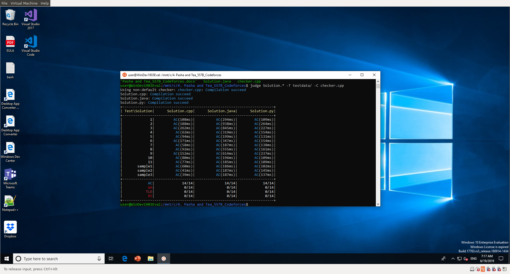
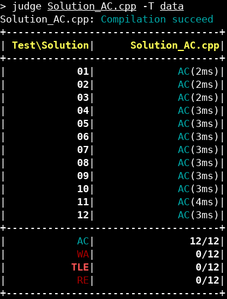
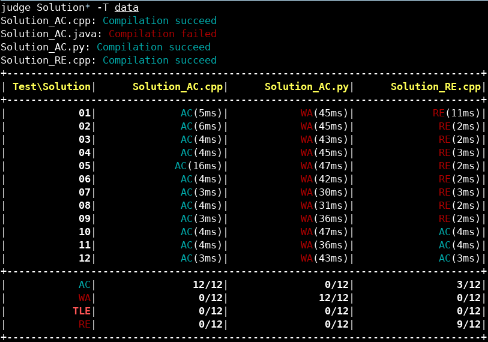
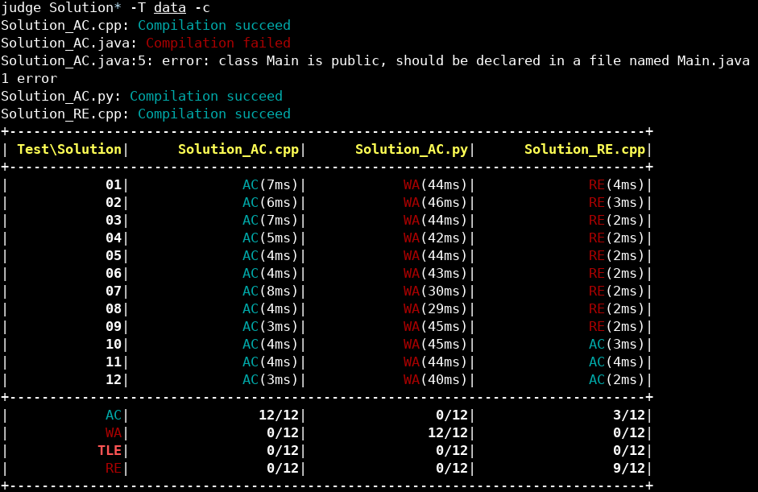
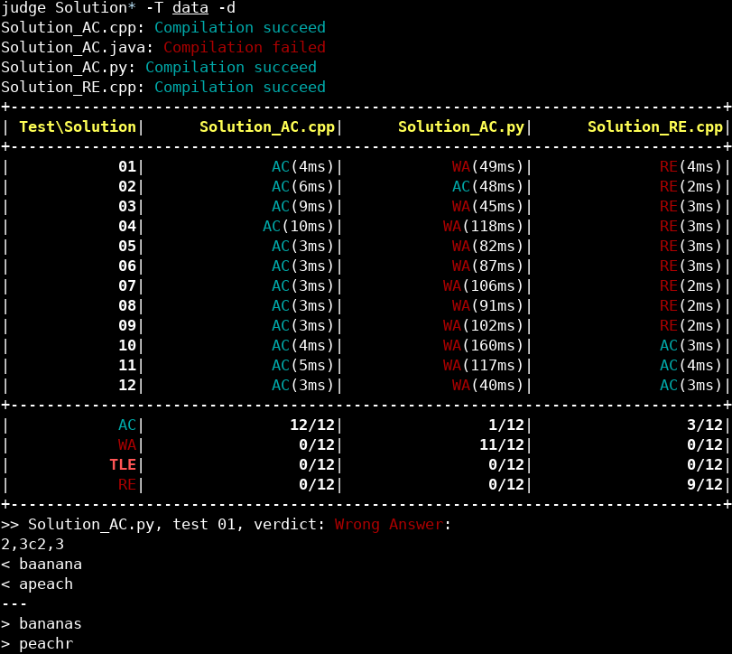
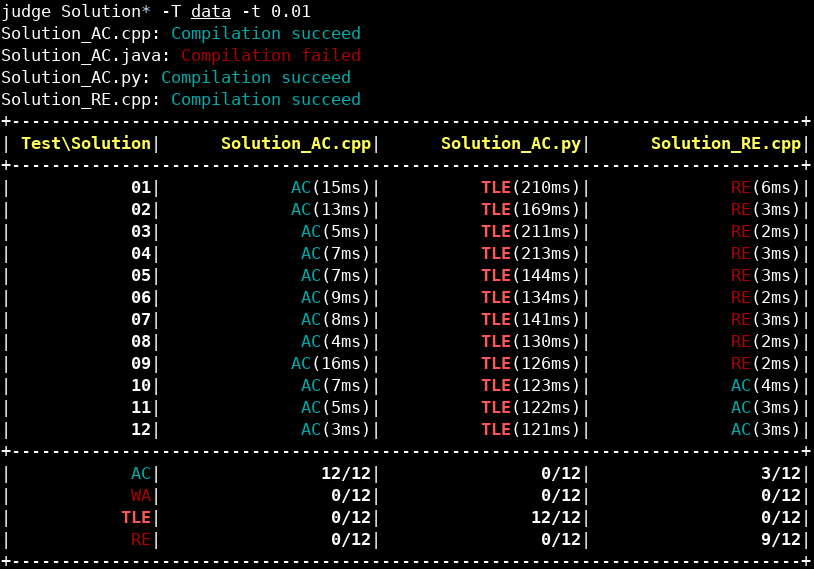
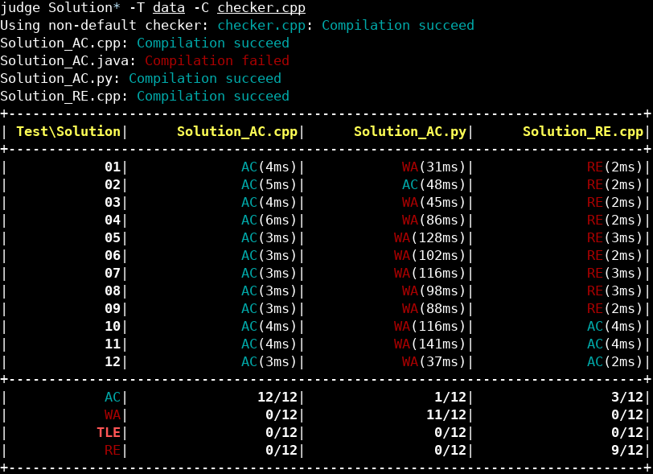

# Tool chấm offline cho Big-O Coding.

Tool này hiện đã được test trên Ubuntu 18.04 và Ubuntu trên Windows 10.



## Cần cài thêm gì để xài:
- make
- g++
- java
```
sudo apt update
sudo apt upgrade
sudo apt install make g++ default-jdk
```
Với **Windows** cần cài Ubuntu (app Ubuntu thôi chứ không phải nguyên cái hệ điều hành nha) trước rồi cài thêm mấy cái ở trên.

## Cài judge tool
```
git clone https://github.com/baosws/offline_judge
cd offline_judge
make
make install
```

## Sử dụng

### Đầu tiên di chuyển vào thư mục chứa sol các thứ (không cần cũng được, nhưng lát hồi sẽ phải nhập địa chỉ solution với test dài hơn).
Ví dụ cần chấm bài Advanced Fruits buổi 11  của Orange ở *Dropbox/TA Big-O Orange/BigO_Orange_Lecture11_DP_LCS (Part II)/4. Advanced Fruits - SPOJ (BTVN Bai 1)*
- Ubuntu:
```
cd ~/"Dropbox/TA Big-O Orange/BigO_Orange_Lecture11_DP_LCS (Part II)/4. Advanced Fruits - SPOJ (BTVN Bai 1)"
```
- Windows: Dropbox nằm ở */mnt/c/Users/<tên User>/Dropbox* nên phải thêm cái đó vào đầu:
```
cd "/mnt/c/Users/Bao/Dropbox/TA Big-O Orange/BigO_Orange_Lecture11_DP_LCS (Part II)/4. Advanced Fruits - SPOJ (BTVN Bai 1)"
```

### Chấm thôi. Bước này tùy điều kiện mà làm khác nhau.
Trong folder này có 4 solution là  *Solution_AC.cpp, Solution_AC.java, Solution_AC.py, Solution_RE.cpp*. Thư mục test tên là *data* (mặc định các cặp input, answer có đuôi là *in* và *ans*). Checker tên là *checker.cpp*:

- Chấm *Solution_AC.cpp*:
```
judge Solution_AC.cpp -T data
```


**Note**: Nếu thư mục test data đặt là *TestData* rồi thì không cần *-T TestData* nữa vì đó là tên test mặc định.


- Chấm cả 4 sol trên:
```
judge Solution* -T data
```


- Hiện lỗi compilation error: **-c**
```
judge Solution* -T data -c
```


- Hiện lỗi runtime error: **-r**
```
judge Solution* -T data -r
```


- Hiện chỗ sai của output so với answer/checker: **-d**
```
judge Solution* -T data -d
```


- Chấm thêm time limit 0.01s: **-t <time tính bằng s>**
```
judge Solution.* -T data -t 0.01
```


- Chấm với checker: **-C <tên checker>**
```
judge Solution.* -T data -C checker.cpp
```


**Note**: checker không nhất thiết phải là C++ nhưng phải theo chuẩn template của anh Phút (coi trong *Cẩm nang trợ giảng*).
### Các option nhảm nhí khác:

Có thể coi help bằng:

```
judge -h
```

| Option | Ý nghĩa |
|--------|---------|
|-I input\_extention| Nếu input không có đuôi mặc định là *in* thì thêm cái này. Ví dụ '-I inp' |
|-A answer\_extension| Nếu answer không có đuôi mặc định là *ans* thì thêm cái này. Ví dụ '-A out' |
|-O options | Option cho checker |
|-p path | Set thư mục làm việc (nhưng chắc không ai xài cái này đâu) |
